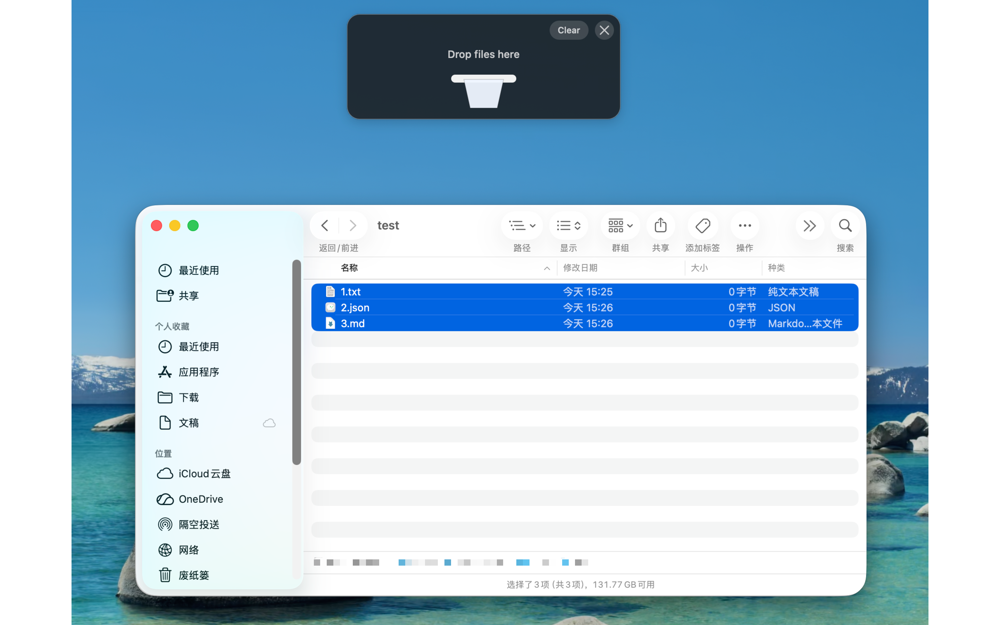

# HoldMac

[简体中文](README.zh-CN.md)

HoldMac is a small native macOS menu bar app that gives Finder a temporary hold area for drag-and-drop file workflows.

When you start dragging files in Finder, HoldMac can show a floating hold area near the top of the screen. Drop files into it, navigate to another folder, then drag them back out to copy or move them. The app stores temporary file references only; it does not duplicate file contents when items are dropped into the hold area.



[Watch the demo video](img/hold-mac.mov)

## Features

- Runs as a lightweight menu bar app without a Dock icon.
- Shows a floating hold area during Finder drags.
- Stores temporary references to files and folders.
- Supports multi-display setups by showing on the active drag screen.
- Lets you drag items back into Finder as copy or move operations.
- Keeps copied items in the hold area and removes successfully moved items.
- Supports a configurable global shortcut for showing the hold area manually.
- Provides drag or shake trigger modes, auto-hide delay, trigger sensitivity, and display placement settings.
- Includes English and Simplified Chinese interfaces.

## Requirements

- macOS 14 or later
- Swift 6 toolchain for development

## Build and Run

Build from the command line:

```sh
swift build
```

Run tests:

```sh
swift test
```

Run the SwiftPM executable:

```sh
swift run HoldMac
```

Create and open the app bundle:

```sh
make app
open .build/文件中转桶.app
```

For Xcode, open `HoldMac.xcodeproj` and run the `HoldMac` scheme. Opening `Package.swift` runs a bare SwiftPM executable, which is useful for quick builds but is not the normal app-bundle launch path for this menu bar app.

Before distributing or signing your own build, set your own bundle identifier and Apple Developer Team in Xcode. The checked-in project uses a neutral placeholder bundle identifier and does not include a developer team.

## How It Works

HoldMac watches for likely Finder file drags. Once triggered, it displays a floating panel where you can drop the current selection. The hold area keeps file URLs in memory so you can move around Finder before dragging the collected items to their destination.

Finder still decides the final copy or move behavior during the destination drop, including its normal modifier-key behavior. HoldMac also provides a configurable default drag-out operation for the files leaving the hold area.

## Privacy

HoldMac keeps temporary runtime file references only. It does not upload files, does not copy file contents into its own storage, and does not require a server.

## Limitations

macOS does not expose a public API for third-party apps to subscribe precisely to "Finder started dragging selected files". HoldMac uses a low-permission heuristic: a global mouse drag that begins while Finder is the frontmost app. This avoids Accessibility permission prompts, but it can occasionally show the hold area for a Finder drag that is not a file drag.

## Contributing

Issues and pull requests are welcome. Please keep changes focused, avoid adding dependencies unless they are necessary, and run `swift test` before submitting changes.

## License

HoldMac is released under the MIT License. See [LICENSE](LICENSE) for details.
