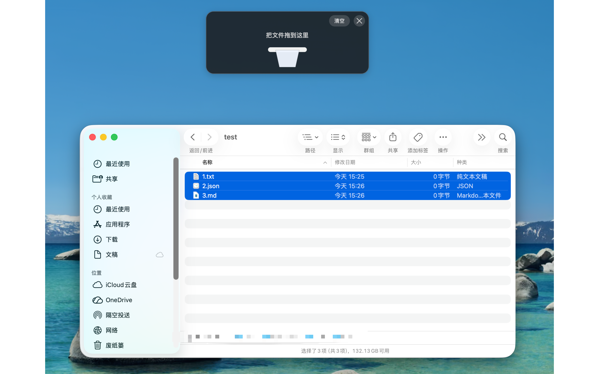

# HoldMac（文件中转桶）

[English](README.md)

HoldMac（文件中转桶）是一个轻量的原生 macOS 菜单栏应用，为 Finder 文件拖拽流程提供临时中转区。

当你在 Finder 中开始拖拽文件时，HoldMac 可以在屏幕顶部附近显示一个悬浮中转桶。把文件先拖进中转桶，切换到目标文件夹后，再从中转桶拖出即可复制或移动。应用只保存临时文件引用；文件进入中转桶时不会复制文件内容。



[观看演示视频](img/hold-mac.mov)

## 功能

- 作为轻量菜单栏应用运行，不显示 Dock 图标。
- 在 Finder 拖拽过程中显示悬浮文件中转桶。
- 临时保存文件和文件夹引用。
- 支持多显示器，可在当前拖拽所在屏幕显示。
- 支持将中转桶内的项目拖回 Finder，并执行复制或移动操作。
- 复制后的项目会继续保留在中转桶中；成功移动后的项目会自动移除。
- 支持配置全局快捷键，手动显示中转桶。
- 支持拖动或晃动触发方式、自动隐藏时间、触发灵敏度和显示位置设置。
- 内置英文和简体中文界面。

## 系统要求

- macOS 14 或更高版本
- 开发需要 Swift 6 工具链

## 构建与运行

命令行构建：

```sh
swift build
```

运行测试：

```sh
swift test
```

运行 SwiftPM 可执行程序：

```sh
swift run HoldMac
```

创建并打开 app bundle：

```sh
make app
open .build/文件中转桶.app
```

如果使用 Xcode，请打开 `HoldMac.xcodeproj` 并运行 `HoldMac` scheme。直接打开 `Package.swift` 会运行一个基础 SwiftPM 可执行程序，适合快速构建，但不是这个菜单栏应用的常规 app bundle 启动方式。

如果你需要签名或分发自己的构建，请在 Xcode 中设置自己的 bundle identifier 和 Apple Developer Team。仓库中的工程使用中性占位 bundle identifier，不包含开发者团队信息。

## 工作方式

HoldMac 会监听可能来自 Finder 的文件拖拽。一旦触发，它会显示一个悬浮面板，你可以把当前选择的文件放入其中。中转桶会在内存中保存文件 URL，让你可以先在 Finder 中切换目录，再把收集好的项目拖到目标位置。

拖到目标位置时，最终复制或移动行为仍由 Finder 决定，包括 Finder 原本支持的修饰键行为。HoldMac 也提供默认拖出操作设置，用来决定文件离开中转桶时默认按复制还是移动处理。

## 隐私

HoldMac 只保存运行时的临时文件引用。它不会上传文件，不会把文件内容复制到自己的存储中，也不依赖服务器。

## 限制

macOS 没有公开 API 能让第三方应用精确订阅“Finder 开始拖拽所选文件”这一事件。HoldMac 使用低权限启发式检测：当 Finder 是前台应用时监听全局鼠标拖拽。这样可以避免请求辅助功能权限，但也可能偶尔在非文件拖拽时显示中转桶。

## 参与贡献

欢迎提交 issue 和 pull request。请尽量保持改动聚焦，除非确有必要不要增加新依赖，并在提交前运行 `swift test`。

## 许可证

HoldMac 使用 MIT 许可证发布。详情见 [LICENSE](LICENSE)。
